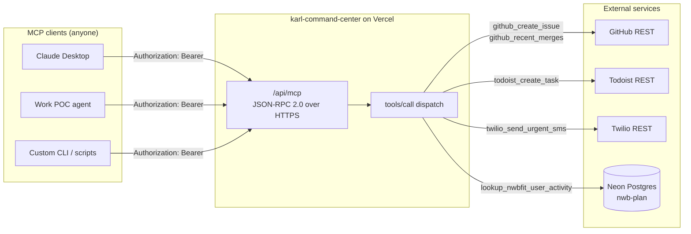
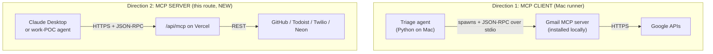
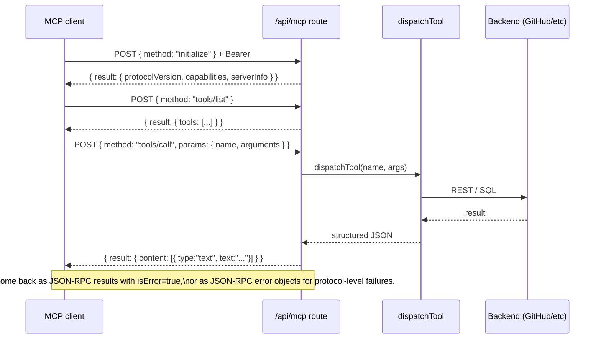
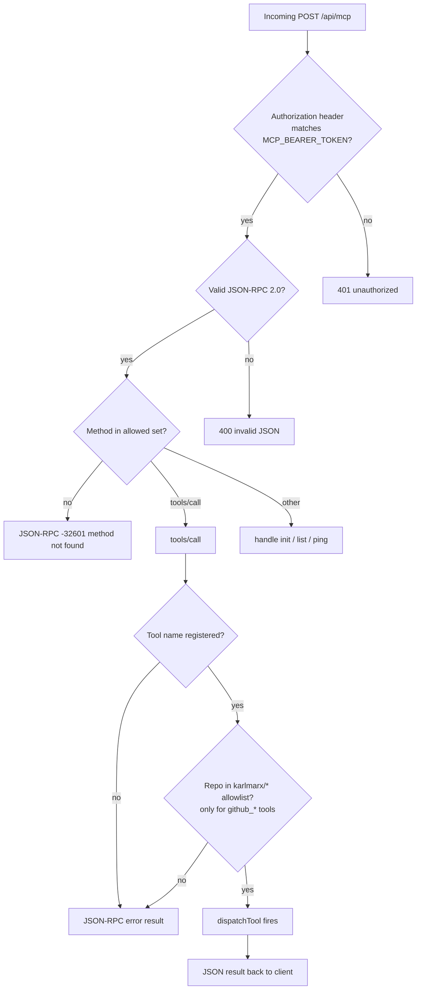

# Triage MCP server (`/api/mcp`)

A Streamable HTTP MCP server that exposes the email-triage tool surface to any
MCP client — Claude Desktop, custom agents, the work POC, etc. Same tools the
local Mac runner uses, just available over the network behind a bearer token.

---

## What it is



## How it relates to the Mac runner

The Mac runner is the **MCP client** for Gmail. This route is the **MCP server**
for everything else. Two directions, same protocol:



The boss demo can now show **both directions of MCP**:
- Mac runner triages email autonomously (uses Gmail MCP).
- Claude Desktop connects to `/api/mcp` and you ask it to file an issue.
Same protocol, same agent loop pattern, just running on different sides of the wire.

---

## Tools exposed

| Tool | Backend | Idempotent | Notes |
|---|---|---|---|
| `github_create_issue` | GitHub REST | No | Repo must be in karlmarx/* allowlist |
| `github_recent_merges` | GitHub REST | Yes (read-only) | Repo allowlist, 48h default window |
| `todoist_create_task` | Todoist REST | No | Priority 1-4, natural-language due |
| `twilio_send_urgent_sms` | Twilio REST | No (sends!) | <= 160 chars recommended |
| `lookup_nwbfit_user_activity` | Neon Postgres | Yes (read-only) | Param-binding, no SQL injection, runs in a read-only transaction |

Gmail tools (`apply_label`, `draft_reply`) are NOT exposed here — they require
the Gmail MCP server that lives on Karl's Mac, not on Vercel.

---

## Protocol

Streamable HTTP MCP. POST JSON-RPC 2.0 to `/api/mcp` with bearer auth.
Responses are JSON (no SSE streaming for these synchronous tool calls).



---

## Required env vars (Vercel project)

| Var | Purpose |
|---|---|
| `MCP_BEARER_TOKEN` | Shared secret for client auth. Generate with `openssl rand -hex 32`. |
| `GITHUB_TOKEN` | PAT with `repo` scope. |
| `TODOIST_TOKEN` | Todoist developer API token. |
| `TWILIO_ACCOUNT_SID` | Twilio dashboard. |
| `TWILIO_AUTH_TOKEN` | Twilio dashboard. |
| `TWILIO_FROM` | Twilio number, E.164. |
| `TWILIO_TO` | Karl's phone, E.164. |
| `NWB_POSTGRES_READONLY_URL` | **Preferred.** Connection string for a dedicated read-only Neon role scoped to nwb-plan. Used by `lookup_nwbfit_user_activity`. |
| `NWB_POSTGRES_URL` | Fallback for the nwbfit lookup when `NWB_POSTGRES_READONLY_URL` is unset. The query still runs in a read-only transaction (see threat model). |

All secrets stay server-side. The `MCP_BEARER_TOKEN` is the only thing clients
need to know — it gates the entire tool surface.

---

## Connecting Claude Desktop

Add this to your Claude Desktop config
(`~/Library/Application Support/Claude/claude_desktop_config.json`):

```json
{
  "mcpServers": {
    "karl-triage": {
      "type": "http",
      "url": "https://karl-command-center.vercel.app/api/mcp",
      "headers": {
        "Authorization": "Bearer <MCP_BEARER_TOKEN>"
      }
    }
  }
}
```

Restart Claude Desktop. The 5 tools appear in the tool list.

**Demo prompt to ask Claude Desktop:**
> "Use my triage tools to check what's been merged to karlmarx/nwb-plan in the
> last 24 hours, then file an issue summarizing what I should look at."

Desktop will call `github_recent_merges` and then `github_create_issue` —
literally the same tool calls the autonomous Mac runner makes when it triages
an urgent prod email.

---

## Threat model and guardrails



- **Auth:** single bearer token. If leaked, rotate `MCP_BEARER_TOKEN`. No
  per-tool gating yet — anyone with the token can call anything.
- **Repo allowlist:** frozen at build time. Hallucinated repos rejected.
- **No budget cap on this server.** The Mac runner caps itself at $1/day for
  Anthropic spend. This server doesn't proxy any LLM calls — each tool is one
  REST or SQL call, max cost is the per-call API fee (≅$0 for GitHub/Todoist,
  ~$0.0075 for Twilio SMS, $0 for the Postgres lookup).
- **SQL injection:** `lookupUserActivity` uses parameterized binding. Even if
  the email arg contained `'; DROP TABLE workout_sessions; --`, pg passes it
  as a value, not as part of the query string.
- **No write access to Neon:** the nwbfit lookup runs inside an explicit
  read-only transaction (`BEGIN TRANSACTION READ ONLY`) with a 5s
  `SET LOCAL statement_timeout`, so any INSERT/UPDATE/DELETE fails with
  *"cannot execute ... in a read-only transaction"* even if the connection
  string carries a read/write role — and it's pooler-safe (honored through
  Neon's pgbouncer in any pooling mode). Belt-and-suspenders: set
  `NWB_POSTGRES_READONLY_URL` to a dedicated read-only Neon role scoped to
  `workout_sessions`. The transaction guard means a misconfigured read/write
  `NWB_POSTGRES_URL` fallback is still safe.

---

## Local development

```bash
npm install            # picks up the new pg dep
cp .env.local.example .env.local   # if you have one, otherwise create manually
# fill in MCP_BEARER_TOKEN + the rest from the table above
npm run dev
# in another terminal:
curl -X POST http://localhost:3000/api/mcp \
  -H "Authorization: Bearer <token>" \
  -H "Content-Type: application/json" \
  -d '{"jsonrpc":"2.0","id":1,"method":"tools/list"}'
```
